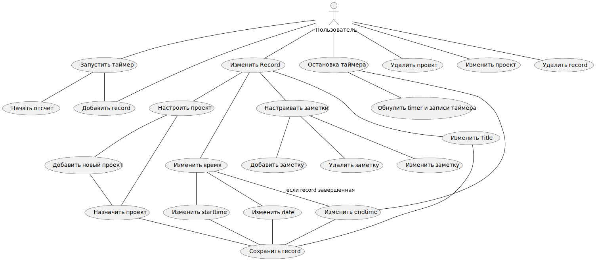
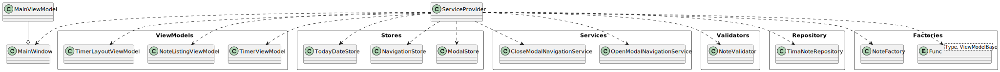
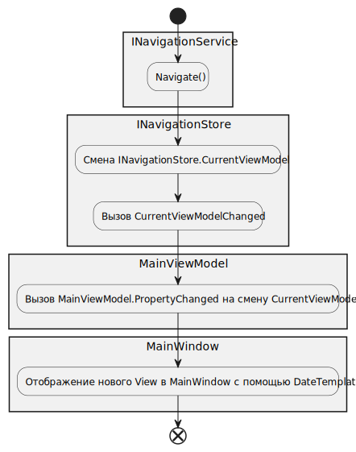

Приложение для сохранения временных промежутков времени (records) с использованием встроенного таймера.

## Use cases

- Пользователь может запустить таймер с введенным заголовком, проектом или значениями по умолчанию и отсчетом от текущего времени

- Пользователь останавливает таймер, все поля таймера обнуляются. Record становится завершенным и получает EndTime от текущего времени
Обнуление полей: title - пустой, project - пустой, time - 00:00:00

- Во время работы таймера возможно изменить время начала отсчета, графа с временем окончания недоступна

- Пользователь может изменять завершенную запись. Изменять время, проект, заголовок, добавлять заметки к записи

- При выборе проекта к record в окне появится список из текущих проектов и "пустого" проекта - проекта по умолчанию. Также пользователь может ввести новый проект и запись автоматически изменит свой проект на новый.

- У пользователя в отдельном окне есть список проектов, где можно изменить имя проекта и удалить проект

### Настроить проект у Record
Пользователь может выбрать

За настройку проекта будет отвечать ProjectForm - модульное окно, которое содержит список проектов с выбранным проектом. При клике на проект окно закрывает, а проект Record меняется на выбранный. Также в ProjectForm есть возможность добавить проект новый проект, при добавлении проект автоматически выбирается

#### Добавить заметку к записи

К завершенной Record пользователь может добавлять Заметки Note, заметок может быть неограниченное количество

- Добавление Notes к записям

## Use Case дополнительные

- Создание интерфейса для плагина

- Плагин для синхронизации с обсидианом

- Импорт данных из toggl

- Настройка автозапуска

-Настройка Date

- Визуальное оформление Project

- Инструменты статистики

- Умная строка
В таймере должны предлагаться название заголовков для Record

> Использование Date
Поле Date представляет собой дату с которая ассоциирована TimaNote. Она нужна для того чтобы ассоциировать записи после полуночи (когда фактически наступил новый день) с предыдущим днем. 

## Реализация use cases

### Устройство Record
Record - класс уровня модели данных

Обязательные для назначения свойства:
DateTime StartTime время начала записи
Guid Id - id записи
DateOnly Date - дата, к которой привязана запись

Свойства с параметрами по умолчанию:
string Ttile - заголовок, по умолчанию пустой
Project Project - проект, по умолчанию Project.Empty
List<Note> Notes - заметки, по умолчанию пустые
DateTime? EndTime - время окончания записи, по умолчанию null

Read-only свойства
bool IsActive - завершенность записи, false, если EndTime =null

ITimeBase - интерфейс для свойств связанный со временем

IRecordViewModelBase : ITimeBase

IEditRecord - интерфейс команд для открытия форм, которые редактируют IRecordViewModelBase

EditableRecordViewModel наследует NotifyDataErrorViewModel и реализует интерфейсы IRecordViewModelBase, IEditRecord

EditableRecordViewModel сохраняет все валидные изменения над Record в репозиторий. EditableRecordViewModel содержит NoteFormViewModel для работы с заметками этой record.

### Работа с заметками
EditableRecordViewModel содержит NoteFormViewModel в котором происходит редактирование новой заметки. После вызова AddNoteCommand, NoteFormViewModel добавляет новую заметку в репозиторий заметок. Обновление репозитория, обновляет репозиторий с record. И тем самым обновляет Record

EditableRecordViewModel содержит ListingNoteViewModel с заметками из Record

ListingNoteViewModel изменяет указанные Note в EditableNoteViewModel, также содержит ссылку на NoteRepository для обновления списка

EditableNoteViewModel содержит Note и свойство Text, и NoteRepository

### Timer

TimerViewModel наследует NotifyDataErrorViewModel и реализует интерфейсы IRecordViewModelBase, IEditRecord

Timer имеет два состояния: выключен (1) и включен (2). При переходе 1-2. Таймер устанавливает StartTime на текущее вермя, а Time показывает разницу между StartTime и текущим временеи. Также при запуске создается и сохраняется в репозиторий новая Record с параметрами, которые ввел пользователь до запуска.

Во время работы таймера (состояние 2). Любые изменения свойств интерфейса IRecordViewModelBase. Применяются к созданной Record и сохраняются в репозитории

Во время выключения таймер (переход 2-1). Сохраняется EndTime с текущим временем и это время сохраняется в Record. Record становится завершенной. Таймер обновляет свои значения на значения по умолчанию

### Валидация RecordViewModel
RecordValidator реализует AbstractValidator<IRecordViewModelBase>. RecordValidator содержит в себе TimeValidator

TimeValidator реализует AbstactValidator<ITimeBase>

Правила валидации:
- StartTime парсится в DateTime
- EndTime парсится в DateTime
- При выполнении условий выше EndTime > StartTime
- Time парсится в TimeSpan

### Проблема установки времени
ITimeBase
string StartTime
string EndTime
string Time

Свойство Time должно быть разностью между EndTime и StartTime. При этом изменяя Time должно изменяться StartTime относительно EndTime. Отсюда должна быть логика, которая автоматически реагирует на подобные изменения.

Если EndTime имеет некорректное значение, то Time также имеет некорректно значение.
Если EndTime имеет корректное значение, то изменение Time изменяет StartTime.
Изменение StartTime на корректное значение, изменяет Time
Изменение Time на корректное значение при корректном EndTime, меняет StartTime

За все это будет отвечать TimeSolver. TimeSolver будет иметь метод Solve, который принимает имя измененного свойства. В зависимости от свойства, значений валидатора TimeSolver будет переназначать необходимые свойства.

TimeSolver имеет два состояния. Solving и NotSolving. Пример: 
- корректно изменилось свойство Time
- вызов TimeSolver, который проверил что все свойства корректны и назнчает StartTime
- изменение StartTime вызывают TimeSolver, который при всех корректных значениях изменит Time

Алгоритм зациклился. Чтобы этого избежать при вызове TimeSolver его состояние ставится на Solving, по окончанию вызова, состояние меняется на NotSolving
Расширение RecordViewModel с формами TimeForm и ProjectForm. Любые корректные изменения из этих форм применяются к полям RecordViewModelWithEdit. Функциональность RecordViewModelWithEdit наследуют TimerViewModel и EditableRecordViewModel
### TimeForm
TimeForm форма по редатированию времени. Содержит TimeValidator, TimeSolver и IRecordViewModelBase, который редактируется. Реализует ITimeBase. TimeForm вызывается как отдельный компонент содержит Close-навигацию
ApplyTimeForm() - утанавливает TimeForm
### ProjectForm
Содержит список Projects, ProjectRepository, IRecordViewModelBase, и выбранный на данный момент проект SelectedProject
- ApplyTimeForm() должна устанавливать TimeForm
ProjectForm может добавлять новый проект и сразу же применять его к выбранной Record. Либо пользователь выбирает проект из списка созданных.
- Поля StartTime, EndTime, Date должны полностью переносится в TimeForm (внезависимости от корректности)
После выбора проекта ProjectForm закрывается. Также имеет свою close-навигацию
- Если поле IsActive true, то оно должно TimeForm должно отключить доступность EndTime
IProjectName - содержит свойство имени проекта, используется в ProjectForm и EditableProject
- Корретный ввод из TimeFrom (поля StartTime, EndTime, Date) должны применятся к полям RecordWithEdit
ProjectNameValidator - проверяет что имя уникально и не хранится в репозитории
- Ввод из ProjectForm должен применяться к полю Project, когда там что-то меняется
Projects содержит проекты в специально контейнере ProjectFromContainer, который состоит из EditableProjectViewModel, если проект не пустой (или null если пустой), IsEmpty, IsSelected - свойства
### Репозитории
Интерфейс для репозиторием IRepository<T>, выполняет CRUD операции, также содержит событие об изменении репозитория
RepositoryChangedEventArgs<T>, которое состоит из объекта и операции совершенной с объектом RepositoryChangedOperation
- Поле TimeForm - при инициализации null
Операции:
- Добавление
- Обновление
- Удаление
- Если форма редактирует активный Record, то EndTime устанавливается на время открытия формы и недоступно для редактирования

Реализация на модели
- Record
- Project
- Note

NotFoundException<T> - исключение, которое выбрасывается если изменяется объект, корого нет в репозитории

## Компоненты (бизнес-логика)

### EditableRecordViewModel
Изменение StartTime или EndTime приводит к изменению времени. Если EndTime или StartTime получают ошибку, то ошибку получает и свойство Time

Тесты (юнит):
- Ввод при инициализации Time должен быть пустой строкой 

ITimeBase
string StartTime
string EndTime
string Time

IRecordViewModelBase : ITimeBase
string Title
Project Project
string Date

IEditRecord
ICommand OpenTimeFrom
ICommand OpenProjectForm

EditableRecordViewModel наследует NotifyDataErrorViewModel и реализует интерфейсы IRecordViewModelBase, IEditRecord

Тесты
- Корректное обновление свойств, обновляет Record в репозитории
- Некорректное обновление, игнорирует обновление

- RemoveRecordCommand должен удалить Record из IRepository

- OnRepositoryUpdate по вызовы должен обновить EditableRecordViewModel новыми данными

### NoteFormViewModel
NoteFormViewModel
_noteRepository - репозиторий с заметками
CurrentText - текущий текст заметки
AddNoteCommand
AddNote(Note)

Тесты
- AddNote вызывает _noteRepository с новой Note и указанным текстом

### ListingNoteViewModel
ListingNoteViewModel

### EditableNoteViewModel
EditableNoteViewModel 

Тесты
- При изменении Text в NoteRepository вызывается Update с обновленной Note

- DeleteNote() вызывает IRepository.Delete() с указанной заметкой
Проекты хранятся в репозитории проектов
- OnRepositoryUpdate - при обновлении репозитория с указанной заметкой, обновляются text и Note
ProjectForm позволяет выбрать проект для текущего Record. Record без проектов содержат специальный Project.Empty. ProjectForm позволяет добавлять, удалять и обновлять проекты.
### TimerViewModel
enum TimerState {
    NotRunning,
    Running
}

string Time показывает отчет таймера, по умолчанию "0:00:00"
_dispatherTimer - запускает background task при запуске таймера
TimerCommand - команда запуска\остановки таймера
- Contains должен возвращать false для не хранящегося проекта
- AddProject должен выбрасывать ошибку если добавленный проект существует
Тесты:
- При запуске таймера создается Record и добавляется в репозиторий
- Record должен иметь StartTime - из поля StartTime, а EndTime - null
- Record должен принимать Title из формы Title или принимать значение по умолчанию
- Record принимает Project из поля Project

- Изменение StartTime должно StartTime в репозитории
- Изменение Title должно изменять Title в репозитории
- Изменение Date должно изменять Date в репозитории
- UpdateProject должен выбрасывать ошибку если проекта с таким Id нет в репозитории
### TimeValidator
Тесты 
- Date парсится в DateOnly
- StartTime парсится в DateTime (1)
- EndTime парсится в DateTime (2)
- При выполнении условий выше EndTime > StartTime (3)
- Time парсится в TimeSpan (4)
- RemoveProject должен удалять проект и возвращать true
- GetProjects() должен возвращать все проекты

- GetId() должен увеличиваться после добавления проекта

- RepositoryChanged должен срабатывать когда добавляет проект
- RepositoryChanged должен срабатывать когда обновляется проект
- RepositoryChanged должен срабатывать если проект удалился
- RepositoryChanged не должен срабатывать если проект не был в репозитории

### TimeForm
Тесты
- Если EndTime установило корректное значение и StartTime корректно - Time изменяется на EndTime - StartTime
- Если EndTime установило корректное значение, а StartTime некорректное, то ничего не происходит
- После инициализации StartTime, EndTime, Time, Date - изменяются на аналогичные из IRecordViewModel

- TimeForm не должен применять значения если IsValid == false

- Тестирование StartTime на значениях (правильных и не очень), должен также изменяться Time
    - Time может быть некорректным
    - EndTime может быть некорректным
- Тестирование EndTime на значениях (правильных и не очень), должен также изменяться Time
- Тестирование Time на значениях (правильных и не очень), должен также изменяться StartTime
- Тестирование Date на значениях (правильных и не очень)
- IsEndTimeEnabled - назначается EndTime как текущее время
- IsEndTimeEnabled выбрасывает исключение при попытке назначить EndTime
- IsEndTimeEndbled - устанавливает корректные значения для StartTime, Time, Date

- Если EndTime < StartTime, изменение StartTime на корректные данные должно приводить к применению StartTime,EndTime,Time на source
- Если EndTime < StartTime, изменение EndTime на корректные данные должно приводить к применению StartTime,EndTime,Time на source

### ProjectFormViewModel
Тесты
- выполнение AddProjectCommand, если нет ошибок валидации, должен создать новый проект с именем из Name и отправить его в репозиторий на добавление
- выполнение AddProjectCommand, если нет ошибок валидации, присваивает новый проект IRecordViewModel
- выполнение AddProjectCommand, если нет ошибок валидации, закрывает ProjectFormViewModel
- выполнение AddProjectCommand, если есть ошибка валидации, вызывает исключение AddingInvalidProjectException

- Name которой назначили пустое имя должна содержать ошибку валидации
- Name которой назначили имя, которое существует в репозитории должна содержать ошибку валидации

- По умолчанию IsCanAdd false, Name - пустое
- Если новое значение Name не проходит валидацию IsCanAdd = false
- Если новое значение Name проходит валидацию IsCanAdd = true

- После инициализации репозиторий возвращает все проекты из ProjectRepository
- Projects должен содержать все проекты из ProjectRepository, а также пустой проект (сортировка - сначала пустой, а потом а алфавитном порядке)
- Проект из IRecordViewModel должен быть выделен в Projects

- SelectProjectCommand присваивает проект из CommandParameter в IRecordViewModel
- SelectProjectCommand закрывает ProjectForm

- Добавление проекта в репозиторий, обновляет Projects в добавленным проектом
- Обновление проекта в репозитории, обновляет Projects и обновленным проект

### ProjectFromContainer
ProjectViewModel
IsEmpty
IsSelected

### EditableProjectViewModel
Тесты
- Если Name присваивает корректное имя, Project присваивает имя и вызывается сохранение проекта с обновленным именем в базе
- Если Name присваивается некорректное имя, HasError станится true, HarPropertyError содержит ошибку с сообщением, репозиторий не вызывается
- Remove() вызывает Remove в репозитории с данным проектом
- RemoveProjectCommand должна вызывать Remove()
- Добавление пустого проекта должно вызывать exception
- При инициалцизации Name EditableProjectViewModel и Name Project должно совпадать
- OnRepositoryChanged если изменился данный проект, должен обновить имя

### ProjectNameValidator
Тесты
- Валидатор не должен пропускать IProjectName если проект с таким именем содержится в репозитории
- Имя IProjectName не должно быть пустым
### IRepository

- Projects должен обновляться когда в репозиторий добавили новый проект
- Projects должен обновляться когда в репозиторий обновили проект
- Projects должен обновляться когда в репозиторий удалили проект
- Projects должен содержать проекты из репозитория при инициализации

- Если SelectedProject изменился, он закрывает форму

AddItem(T item)
UpdateItme(T item)
Тесты
- Contains должен возвращать true если проект хранится, иначе false
- AddItem должен добавлять новый проект в репозиторий
- AddItem должен выбрасывать исключение если добавленный проект существует
- AddItem должен выбрасывать исключение если добавленный проект с таким названием уже есть
- UpdateItem должен обновлять проект с таким же Id
- UpdateItem должен выбрасывать исключение если проекта с таким Id нет в репозитории
- UpdateItem должен выбрасывать исключение, если изменяется пустой проект
- RemoveItem должен удалять проект и возвращать true или возвращать False если проекта не было в репозитории
- RemoveItem должен выбрасывать исключение если удаляется пустой проект
- Contains должен возвращать true если проект с таким именем есть или false если нет
- GetItems() должен возвращать все проект подходящие под предикат
- GetItems не должен возвращать пустой проект
Contains(T item)
GetItems(predicate)
event RepositoryChanged

### ProjeсtRepository
Хранилище для проектов

Имеет свойство Time, которое является разностью EndTime и StartTime 
### RecordRepository
Тесты
- AddItem должен добавлять новый Record
- AddItem выбрасывает исключение если Record с таким Id существует
- UpdateItem должен обновлять Record новыми данными
- UpdateItem выбрасывает исключение если Record с заданным Id не хранится
- Contains проверяет Record по Guid
- RemoveItem удаляет Record и возвращает true, иначе false
- GetItems должен возвращать Record подходящие под предикат
- AddItem вызывает событие по добавлениею элемента
- UpdateItem вызывает событие по обновлению элемента
- RemoveItem вызывает событие по удалению элемента

Тесты
- Корректные изменения полей должны изменять Record в репозитории
- Некорректные изменения полей не должны измениять Record в репозитории
- Добавление заметки должно добавлять ее в репозиторий
- Удаление Record должно удалять ее из репозитория
- Time изменяется когда изменяется Record
- DeleteRecord() должен удалять Record из репозитория

### ListingRecordViewModel
ListingRecordViewModel обращается к RecordListingStore, который содержит текущие список Record

ListingRecordViewModel подписан на изменения RecordListingStore, в случае изменения обновляет

Список должен пролистываться вниз с некоторым лимитом и подгружаться в случае необходимости

Тесты

При инициализации ListingRecordViewModel берет записи из стора и создает из них список RecordViewModel

Должен быть подписан на событие ListingRecordStore и обновлять Records

Во время вызова события должен вызываться PropertyChanged у Records

#### ListingRecordStore
Содержит текущий список Record, изменяет этот список по заданным параметрам. За списком обращается в RecordRepository

FilterListingArgs - параметры фильтрации

Пока что попробуем объединить любые изменения в одно событие (посмотрим как будет визуально смотреться)

ListingChanged - событие уведомляющее об изменении списка
FilterChanged - событие уводомляющее что нужно заменить один список другим

Тесты:
По умолчанию ListingRecordStore получает пустой FilterListingArgs, поэтому в Records все неактивные записи

ListingRecordStore должен получить список из репозитория по указанным параметрам фильтрации

Изменение параметров фильтрации должно приводить к изменению списка в store

FilterChanged должен срабатывать когда меняются параметры фильтра и обновлять текущий список

ListingChanged должен сработать когда в репозиторий добавили новый record и он подходит под параметры фильтрации и обновить текущий список

ListingChanged должен сработать когда обновили record и он подходит под параметры фильтрации и обновить текущий список

ListingChanged должен сработать когда удалили record и он подходит под параметры фильтрации и обновить текущий список

## Инфраструктурные решения
### DI-контейнер
Используется расширение Microsoft.Extensions.DependencyInjection. Регистрируются серивисы в ServiceCollection и создается ServiceProvider. 

Все объекты хранятся внутри контейнера, если нужны параметры для инициализации создаем фабричные методы и инъектируем их в энужный экземпляр

Фабричные методы хранятся в App

#### Список объектов DI-контейнера

- MainWindow via MainViewModel

ViewModels:
- TimerViewModel
- NoteListingViewModel
- TimerLayoutViewModel

Stores:

- ModalStore
- NavigationStore
- TodayDateStore

Services:

- OpenModalNavigationService
- CloseModalNavigationService

Validators:

- NoteValidator

Repository
- TimaNoteRepository

Factories
- Func<Type, ViewModelBase> - factory via ServiceProvider
- NoteFactory

#### Фабричные методы в классе App
- TimeFormFactory
- ModalParameterizedNavigationService - навигация внутри модального окна в качестве параметра принимает ViewModel
- ModalNavigationServiceFactory - сервис навигации ViewModel берется из ServiceProvider. Не используется по умолчанию
- TimerLayoutNavigationServiceFactory<TViewModel> - сервис навигации для TimerLayoutViewModel, исопльзует ContentViewModel типа TViewModel из ServiceProvider. Не используется по умолчанию
- NavigationServiceFactory
- TimerViewModelFactory - создан из-за специфического сервиса навигации

### Навигация
MainViewModel хранит ссылку на NavigationStore и отслеживает изменения в его CurrentViewModel. Каждый конкретный экземпляр INavigationService должен менять INavigationStore.CurrentViewModel под нужные ViewModel

#### Список переходов в приложении
- При запуске должен открываться TimerLayoutViewModel с контентом NoteListingViewModel
- EditableNote открывает модальное окно TimeFormViewModel
- EditableNote открывает модальное окно ProjectFormViewModel

### Хранение данных