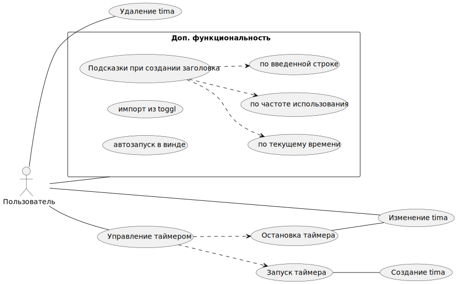
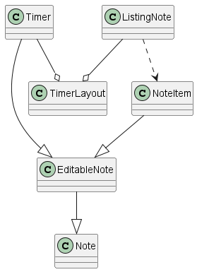
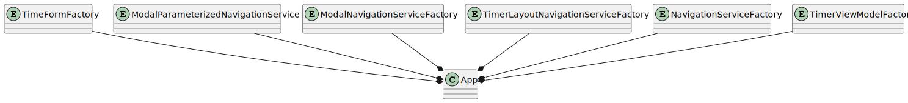

Приложение для сохранения временных промежутков времени (notes) с использованием встроенного таймера.

## Use cases

- Управление таймером
    - Запуск таймера (создает note)
    - Остановка таймер (изменяет созданных note)
    - Изменение note во время работы таймера
- Управлением списком готовых note
    - Изменение note
    - Удаление note
    - Фильтрация по проектам
    - Группировка по дням
> [!note] Дополнительные функции
> - Всплывающие подсказки по запуску таймера
>     - по текущему времени
>     - по частоте использования tima note
> - Импорт данных из toggl
> - Автозапуск
> - Система уведомлений
> - Настройки
>   - Изменение Date на следующий день


## Модель данных

Note
- StartTime - время запуска
- EndTime - время остановки, может быть null
- IsDone - завершенность, завершено если есть EndTime
- Title - заголовок, может быть null
- Note - заметка
- Date - дата, связанная с записью
- Project - проект

### Визуальные компоненты
Project
- Name - имя

Timer
- запуск таймера, создание и сохранение Note
- редактирование Note через формы
- остановка таймера с изменением Note

TimeForm
Форма для изменения времени.

ProjectForm
Форма для изменения проекта

Note
Компонент Note с возможностью редактирования данных

NoteListing
- Список Note сгруппированный по Date



## Алгоритмизация use case

### Процесс работы таймера

```
Нажатие пользователя на таймер
Создание нового tima note без EndTime
    Проверка валидации, в случае неверного ввода поставить значение по умолчанию и вывести пользователю подсказку о неверном вводе
Если данные о tima note изменяются сохранять их в базу
Нажатие пользователя на таймер
Остановка таймера
Сохранение tima note с endtime текущего времени (перевод tima note в состояние завершенного)
```


### Изменение TimaNote
Пользователь может менять Title, Note в соответствующей форме
#### Изменение времени
Пользователю высвечивается поле Time, которое является разностью EndTime-StartTime. 
При клике на поле должна выходить форма. Форма содержит четыре поля с привязанными Time, StartTime, EndTime, Date

Первое поле изменияет StartTime относительно введенного времени. Поля StartTime и EndTime изменяются по времени, а также с возможностью выбора даты для каждого соответственно

> Использование Date
Поле Date представляет собой дату с которая ассоциирована TimaNote. Она нужна для того чтобы ассоциировать записи после полуночи (когда фактически наступил новый день) с предыдущим днем. 

##### Валидация

StartTime и EndTime, должны иметь корректные числовые значени

EndTime не должно быть раньше StartTime
##### Алгоритм формы валидации времени


#### Изменение проекта
TimeNote может не иметь проекта или иметь из списка существующих.
Список проектов также имеет форму для создания нового

##### Алгоритм изменения проекта


## Инфраструктурные решения
### DI-контейнер
Используется расширение Microsoft.Extensions.DependencyInjection. Регистрируются серивисы в ServiceCollection и создается ServiceProvider. 

Все объекты хранятся внутри контейнера, если нужны параметры для инициализации создаем фабричные методы и инъектируем их в энужный экземпляр

Фабричные методы хранятся в App

#### Список объектов DI-контейнера

- MainWindow via MainViewModel

ViewModels:
- TimerViewModel
- NoteListingViewModel
- TimerLayoutViewModel

Stores:

- ModalStore
- NavigationStore
- TodayDateStore

Services:

- OpenModalNavigationService
- CloseModalNavigationService

Validators:

- NoteValidator

Repository
- TimaNoteRepository

Factories
- Func<Type, ViewModelBase> - factory via ServiceProvider
- NoteFactory


#### Фабричные методы в классе App
- TimeFormFactory
- ModalParameterizedNavigationService - навигация внутри модального окна в качестве параметра принимает ViewModel
- ModalNavigationServiceFactory - сервис навигации ViewModel берется из ServiceProvider. Не используется по умолчанию
- TimerLayoutNavigationServiceFactory<TViewModel> - сервис навигации для TimerLayoutViewModel, исопльзует ContentViewModel типа TViewModel из ServiceProvider. Не используется по умолчанию
- NavigationServiceFactory
- TimerViewModelFactory - создан из-за специфического сервиса навигации



### Навигация
MainViewModel хранит ссылку на NavigationStore и отслеживает изменения в его CurrentViewModel. Каждый конкретный экземпляр INavigationService должен менять INavigationStore.CurrentViewModel под нужные ViewModel


#### Модальное окно


#### Список переходов в приложении
- При запуске должен открываться TimerLayoutViewModel с контентом NoteListingViewModel
- EditableNote открывает модальное окно TimeFormViewModel
- EditableNote открывает модальное окно ProjectFormViewModel

### Редактирование Note


### Хранение данных