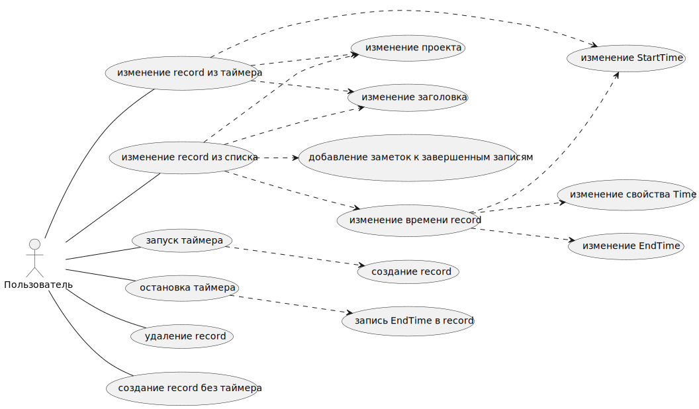
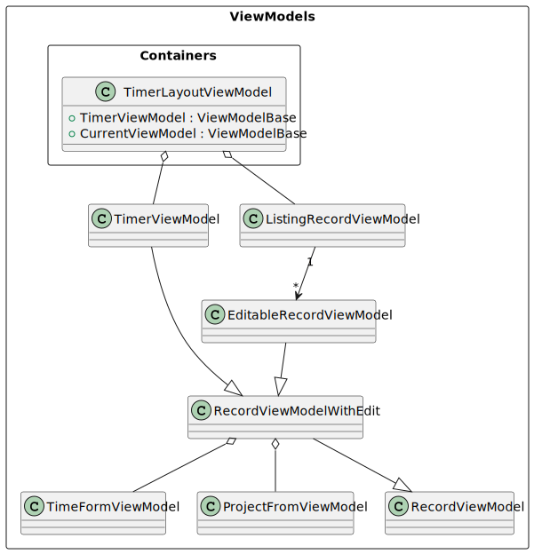
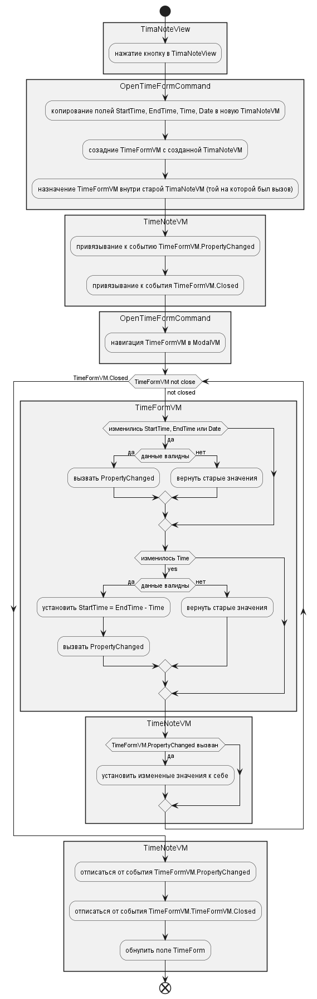
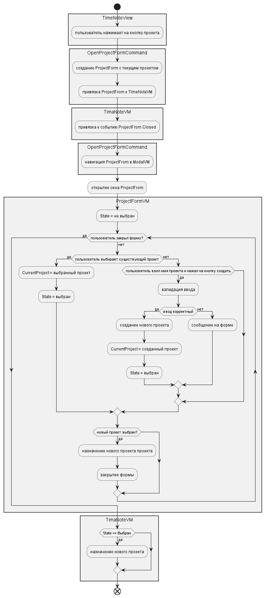

Приложение для сохранения временных промежутков времени (records) с использованием встроенного таймера.

## Use cases

Пользователь может запустить таймер с введенным заголовком и отсчетом от текущего времени или значениями по умолчанию

- Запуск таймера
- Создание record

Во время работы таймера пользователь может менять заголовок, проект и время (время окончания не доступно)

- Изменение Title
- Изменение StartTime
- Изменение Project

Во время остановки таймера Record сохраняется в списке
- Остановка таймера и запись времени окончания в Record

Список сгруппирован по Date, пользователь может создавать, удалять записи, изменять заголовок, проект, время, добавлять заметки
- Удаление Record
- Создание Record без таймера
- Изменение StartTime и EndTime, а также связанного свойства Time

К завершенной Record пользователь может добавлять Заметки Note, заметок может быть неограниченное количество

- Добавление Notes к записям

Пользователь может добавлять проект из списка или создать новый

- Создание проекта

Список группируется по Date

### Дополнительные функции
Список Records, отфильтрованные по проекту

При создании Records в таймере, должны всплываться подсказки содержащие уже созданные records. Подсказки должны фильтроваться должны образом

Импорт данных из toggl

Автозапуск приложения

Система уведомлений

Настройки

## Модель данных
Record
- StartTime - время запуска
- EndTime - время остановки, может быть null
- IsDone - завершенность, завершено если есть EndTime
- Title - заголовок
- Notes - список заметок
- Date - дата, связанная с записью
- Project - проект
- Id

> Использование Date
Поле Date представляет собой дату с которая ассоциирована TimaNote. Она нужна для того чтобы ассоциировать записи после полуночи (когда фактически наступил новый день) с предыдущим днем. 

Project
- Name
- Id

Note 
- Text
- Id

### Компоненты

Timer

TimeForm

ProjectForm

ListingRecord

EditableRecord

## Алгоритмизация use case и тестирование

### Таймер

#### Запуск таймера
Тесты:
- При запуске таймера создается Record и добавляется в репозиторий
- Record должен иметь StartTime - из поля StartTime, а EndTime - null
- Record должен принимать Title из формы Title или принимать значение по умолчанию
- Record принимает Project из поля Project

- Изменение Date должно изменять Date в репозитории

- Если поле не прошло валидацию должно ставиться значение по умолчанию
    - Title - пустая строка
    - Project - пустой проект
    - StartTime - текущее время
    - Date - текущая дата

#### Валидация ввода таймера
Тесты:
- Изменение поле Record (Title, Project, StartTime) должно приводить к изменению Record в репозитории
- Если валидация полей не прошла изменения не должны применяться в репозитории
- Если валидация полей не прошла в Timer должна быть ошибка для соответствующего поля
- Если валидация полей прошла, то соответствующие изменения сохраняются в репозитории

### Валидация RecordViewModel
RecordViewModel содержит поля
- StartTime
- EndTime
- Title
- Date
- IsActive bool

А также логику валидации этих полей с помощью RecordValidator. В случае ошибки валидации NorifyDataError покажет об ошибке поля, при введенные данные сохранятся в поле

Тесты
- Если ввод EndTime приводит к тому что EndTime раньше StartTime это приводит к ошибки по полю EndTIme

- Если ввод StartTime приводит к тому что EndTime раньше StartTime это приводит к ошибки по полю StartTime

- Ввод при инициализации StartTime, EndTime, Date должен быть пустой строкой и не содержать ошибки для каждого свойства

- Если пустая строка назначается во второй раз, то это приводит к ошибке для StartTime, EndTime, Date

- Неправильный ввод StartTime, EndTime, Date должен приводить к ошибки по данному полю

#### RecordViewModelWithEdit
Расширение RecordViewModel с формами TimeForm и ProjectForm. Любые корректные изменения из этих форм применяются к полям RecordViewModelWithEdit. Функциональность RecordViewModelWithEdit наследуют TimerViewModel и EditableRecordViewModel

ApplyTimeForm() - утанавливает TimeForm

Тесты (интеграционные)
- ApplyTimeForm() должна устанавливать TimeForm

- Поля StartTime, EndTime, Date должны полностью переносится в TimeForm (внезависимости от корректности)

- Если поле IsActive true, то оно должно TimeForm должно отключить доступность EndTime

- Корретный ввод из TimeFrom (поля StartTime, EndTime, Date) должны применятся к полям RecordWithEdit
- Некорректный ввод из TimeFrom (поля StartTime, EndTime, Date) должен игнорироваться
- Ввод из ProjectForm должен применяться к полю Project, когда там что-то меняется
- Поле TimeForm - при инициализации null
- При инициализации поля TimeFrom, RecordViewModelWithEdit должен подписываться на события TimeForm.PropertyChanged и TimeForm.Closed 

- Если форма редактирует активный Record, то EndTime устанавливается на время открытия формы и недоступно для редактирования

##### TimeForm
Алгоритм использования формы валидации времени у record:

При клике на поле должна выходить форма. Форма содержит четыре поля Time, StartTime, EndTime, Date. 

Time является разностью времени EndTime и StartTime

Time при измнении изменяет поле StartTime. 

Изменение StartTime или EndTime приводит к изменению времени. Если EndTime или StartTime получают ошибку, то ошибку получает и свойство Time

Тесты (юнит):
- Ввод при инициализации Time должен быть пустой строкой 

- При инициализации Time не содержать ошибки

- Если пустая строка в Time назначается во второй раз, то это приводит к ошибке

- Неправильный ввод Time должен приводить к ошибки по данному полю

- Если IsEndTimeEnabled false, EndTime устанавливает текущее время

- Если IsEndTimeEnabled false, то EndTime не изменяет своего значения

- Если StartTime изменил значение, а EndTime и Time пустые, то они не изменяются

- Если EndTime изменил значение, а StartTime и Time пустые, то они не изменяются

- Если измененные пустые значения ставятся дважды, то они вызывают ошибку в Time

- Если Time корректно изменило значение, но EndTime некорректное, то Time должно иметь ошибку

- Если Time корректно изменило значение и EndTime корректное, то оно должно менять StartTime

- Если Time некорректное, то StartTime не меняет значения

- Если EndTime некорректное, то EndTime не меняет значения

##### ProjectForm
Record может не иметь проекта или иметь из списка существующих.
Список проектов также имеет форму для создания нового

Алгоритм изменения проекта

##### EditableRecordViewModel
RecordViewModel, который хранит завершенную Record и при любых изменениях отправляет эти изменения в репозиторий

Имеет возможность добавлять заметки к записям

Имеет свойство Time, которое является разностью EndTime и StartTime 

DeleteRecord() - удаляет record из репозитория

Тесты
- Корректные изменения полей должны изменять Record в репозитории
- Некорректные изменения полей не должны измениять Record в репозитории
- Добавление заметки должно добавлять ее в репозиторий
- Удаление Record должно удалять ее из репозитория
- Time изменяется когда изменяется Record
- DeleteRecord() должен удалять Record из репозитория

### ListingRecordViewModel
ListingRecordViewModel обращается к RecordListingStore, который содержит текущие список Record

ListingRecordViewModel подписан на изменения RecordListingStore, в случае изменения обновляет

Список должен пролистываться вниз с некоторым лимитом и подгружаться в случае необходимости

Тесты

При инициализации ListingRecordViewModel берет записи из стора и создает из них список RecordViewModel

Должен быть подписан на событие ListingRecordStore и обновлять Records

Во время вызова события должен вызываться PropertyChanged у Records

#### ListingRecordStore
Содержит текущий список Record, изменяет этот список по заданным параметрам. За списком обращается в RecordRepository

FilterListingArgs - параметры фильтрации

Пока что попробуем объединить любые изменения в одно событие (посмотрим как будет визуально смотреться)

ListingChanged - событие уведомляющее об изменении списка
FilterChanged - событие уводомляющее что нужно заменить один список другим

Тесты:
По умолчанию ListingRecordStore получает пустой FilterListingArgs, поэтому в Records все неактивные записи

ListingRecordStore должен получить список из репозитория по указанным параметрам фильтрации

Изменение параметров фильтрации должно приводить к изменению списка в store

FilterChanged должен срабатывать когда меняются параметры фильтра и обновлять текущий список

ListingChanged должен сработать когда в репозиторий добавили новый record и он подходит под параметры фильтрации и обновить текущий список

ListingChanged должен сработать когда обновили record и он подходит под параметры фильтрации и обновить текущий список

ListingChanged должен сработать когда удалили record и он подходит под параметры фильтрации и обновить текущий список

## Хранилище данных
IRecordRepository - репозиторий с Record
GetNewId() - дает новый свободный Id для создания репозитория

AddRecord(Record) - добавить новую Record

DeleteRecord(Record) - возвращает true если запись была найдена и удалена и false если не найдена

Contains(Record) - проверяет содржится ли Record в репозитории

UpdateRecord(Record) - обновляет Record

GetAllRecords(predicate) - дает все записи удовлетворяющие предикату, по умолчанию дает все записи

GetRecords(FilterListingArgs) - дает все записи удовлетворящие фильтру

RecordsChanged - вызывается когда изменяется репозиторий

### RecordRepository

Тесты
- GetNewId - должен давать Id, которого нет в хранилище
- AddNewRecord  должен добавлять новую Record
- AddNewRecord должен выбрасывать Exception, если Record с таким Id существует
- UpdateRecord - должен обновлять Record, если она есть в репозитории
- UpdateRecord должен выбрасывать исключение, если Record нет в репозитории

- GetRecords должен выдавать все Record EndTime которых раньше From
- GetRecords должен выдавать все Record EndTime которых позже To
- GetRecords должен выдвать все Record с заданным проектами
- GetRecords должен выдавать нужное количество элементов по убывания свойства EndTime
- GetRecords должен выдавать активные Record, если так задан FilterArgs
- GetRecords должен выдавать все неактивные Record, если FliterArgs пустой

- RecordsChanged вызывается когда добавляется новый Record

#### RepositoryChangedEventArgs
- RepositoryChangedOperation операция по изменению списка
    - Add добавление элемента
    - Delete удаление
    - Update обновление
- Record с которым производится операция

#### FilterListingArgs
Параметры фильтрации для Record

From и To параметры выбора временного периоды. From позже чем To, и вообще список всегда упорядочен по EndDate по убыванию даты

- From - время откуда начинать счтитать фильтрует EndTime
- To - время до куда начинать считать, фильтрует EndTime
- Projects - список проектов, по умолчанию null - любой
- Count - количество Record, по умолчанию null
- Date - фильтрация по подходяще дате, может быть null
- IsActive - если IsActive, то To и From должны быть null, может быть null

Метод IsValid(Record) - проверяет подходит ли Record под заданные параметры фильтра

## Инфраструктурные решения
### DI-контейнер
Используется расширение Microsoft.Extensions.DependencyInjection. Регистрируются серивисы в ServiceCollection и создается ServiceProvider. 

Все объекты хранятся внутри контейнера, если нужны параметры для инициализации создаем фабричные методы и инъектируем их в энужный экземпляр

Фабричные методы хранятся в App

#### Список объектов DI-контейнера

- MainWindow via MainViewModel

ViewModels:
- TimerViewModel
- NoteListingViewModel
- TimerLayoutViewModel

Stores:

- ModalStore
- NavigationStore
- TodayDateStore

Services:

- OpenModalNavigationService
- CloseModalNavigationService

Validators:

- NoteValidator

Repository
- TimaNoteRepository

Factories
- Func<Type, ViewModelBase> - factory via ServiceProvider
- NoteFactory

#### Фабричные методы в классе App
- TimeFormFactory
- ModalParameterizedNavigationService - навигация внутри модального окна в качестве параметра принимает ViewModel
- ModalNavigationServiceFactory - сервис навигации ViewModel берется из ServiceProvider. Не используется по умолчанию
- TimerLayoutNavigationServiceFactory<TViewModel> - сервис навигации для TimerLayoutViewModel, исопльзует ContentViewModel типа TViewModel из ServiceProvider. Не используется по умолчанию
- NavigationServiceFactory
- TimerViewModelFactory - создан из-за специфического сервиса навигации

### Навигация
MainViewModel хранит ссылку на NavigationStore и отслеживает изменения в его CurrentViewModel. Каждый конкретный экземпляр INavigationService должен менять INavigationStore.CurrentViewModel под нужные ViewModel

#### Список переходов в приложении
- При запуске должен открываться TimerLayoutViewModel с контентом NoteListingViewModel
- EditableNote открывает модальное окно TimeFormViewModel
- EditableNote открывает модальное окно ProjectFormViewModel

### Хранение данных